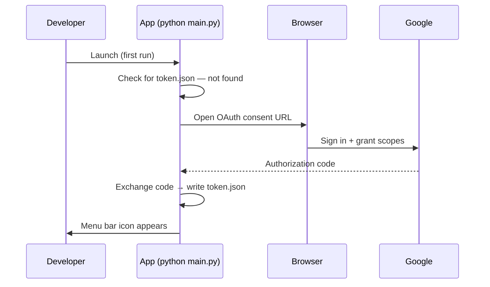

# What the feature is

One-time bootstrap of the Phantom Calendar environment. Creates a Python virtual environment, installs all dependencies, connects to Google Cloud, completes the OAuth flow, and confirms the app appears in the macOS menu bar.

# Why we need it

Every subsequent feature depends on a valid OAuth token and a runnable app scaffold. Calendar reads, alarm compute, the popup, and the scheduler cannot be built or tested without this foundation in place.

# Acceptance Criteria (testable)

**AC1 — Virtual environment**
Given Python 3.14 is installed on the machine, when setup is run, then a virtual environment exists at the project root and all declared dependencies install into it without errors.

**AC2 — OAuth first-run prompt**
Given `credentials.json` is present in the project root and no `token.json` exists, when the app is launched, then a browser window opens and prompts the user to sign in with Google.

**AC3 — Token persisted**
Given the user completes the OAuth browser flow successfully, when the flow closes, then `token.json` is created at the project root and no browser prompt appears on the next launch.

**AC4 — Menu bar icon appears**
Given setup is complete and the virtual environment is active, when the app is launched, then the clock icon appears in the macOS menu bar.

**AC5 — Menu responds**
Given the menu bar icon is visible, when clicked, then a dropdown appears containing at least "Run now" and "Quit".

**AC6 — Missing credentials handled**
Given `credentials.json` is absent, when the app is launched, then the app exits gracefully with a readable error message — no crash, no silent failure.

# System Constraints

- macOS only
- Python 3.14
- `venv` required — no installs into system Python
- Google Cloud project must have Calendar API and Drive API enabled
- OAuth consent screen must include the developer's Gmail as a test user
- `credentials.json` and `token.json` must be excluded from source control

# Non-goals

- Multi-user or team setup
- Linux or Windows support
- Automated GCP project creation (manual console steps are acceptable)
- Packaging as a `.app` bundle — belongs in the Menu Bar App feature
- Adding to macOS Login Items — belongs in the Menu Bar App feature

# Interaction Flow

