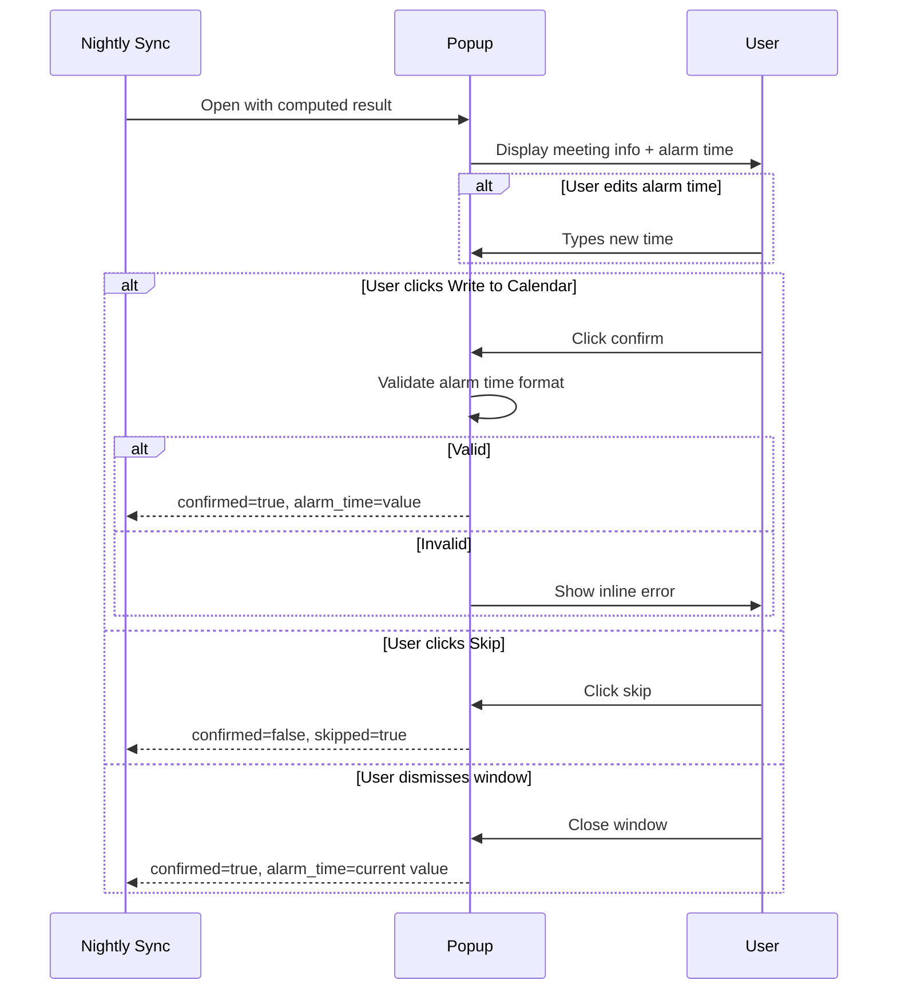

# What the feature is

A confirmation window shown to the user after alarm time is computed. Displays tomorrow's first meeting, the computed alarm time, and any warnings. Allows the user to adjust the alarm time, confirm, or skip. Returns a response for the calendar writer to act on.

# Why we need it

The computed alarm time may be wrong — an unknown MSI block, a misconfigured prep time, or a personal event the user wants to ignore. This step gives the user a final check before anything is written to the calendar.

# Acceptance Criteria (testable)

**AC1 — Popup always appears**
Given computation completes (any result including no meetings and baseline match), when the nightly sync runs, then the confirmation window opens and displays the result.

**AC2 — First meeting shown**
Given the result contains a first meeting, when the popup opens, then the meeting name, meeting start time, and prep minutes are displayed.

**AC3 — Alarm time is editable**
Given the popup is open and an alarm time was computed, when the user edits the alarm time field, then the edited value is used as the confirmed alarm time.

**AC4 — Invalid alarm time blocked**
Given the user has entered a malformed time in the alarm field, when the user clicks "Write to Calendar", then the action is blocked and an inline error message indicates the expected format.

**AC5 — Write to Calendar action**
Given the popup is open, the result is not a baseline match, and a valid alarm time is present, when the user clicks "Write to Calendar", then the popup closes and the response indicates confirmed with the current alarm time value.

**AC6 — Skip action**
Given the popup is open, when the user clicks "Skip", then the popup closes and the response indicates skipped — no calendar write occurs.

**AC7 — Window dismiss treated as confirmed**
Given the popup is open, when the user closes the window via the close button or keyboard shortcut without clicking a button, then the response is treated as confirmed with the current alarm time value.

**AC8 — Baseline case shown**
Given the computed alarm matches the baseline, when the popup opens, then a message indicates no new calendar event is needed and the "Write to Calendar" button is not shown.

**AC9 — No-meetings case shown**
Given the result contains no meetings, when the popup opens, then a message indicates no meetings were found for tomorrow and no alarm time is displayed.

**AC10 — Unknown blocks warning shown**
Given the result contains one or more unknown MSI blocks, when the popup opens, then a non-blocking warning displays the count of unknown blocks and states the default prep time was applied.

**AC11 — Popup appears in front**
Given the popup is triggered at 7pm, when it opens, then it appears above all other windows and takes focus.

# System Constraints

- Receives the structured result from NPC-0001 as input
- Returns a structured response (confirmed, alarm time, skipped) for NPC-0003 to act on
- Whether to show the popup in the baseline and no-meetings cases is fixed to "always show" — configurability is a future concern
- Window must claim focus on open (user may be in another app at 7pm)

# Non-goals

- Writing to the calendar (belongs in NPC-0003)
- Triggering the sync or scheduling the popup (belongs in NPC-0003)
- Configurable show/hide behavior for baseline or no-meetings cases
- Snooze or "remind me later" behavior
- Displaying all meetings for tomorrow (only first meeting shown)

# Interaction Flow

