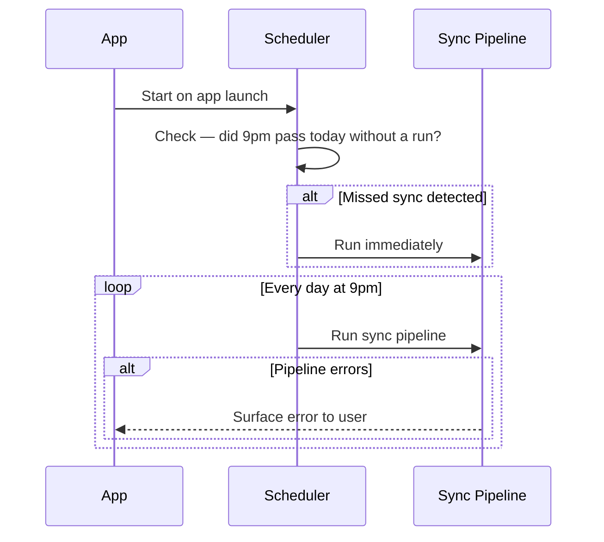

# What the feature is

Runs the full nightly sync pipeline (calendar read → alarm compute → confirmation popup → calendar write) automatically every day at 9pm. If the app was not running at trigger time, runs the missed sync when the app next starts.

# Why we need it

Without a scheduler, the user must manually trigger the sync every evening. This feature makes the alarm computation automatic and invisible — the popup just appears at 9pm without any user initiation.

# Acceptance Criteria (testable)

**AC1 — Daily trigger**
Given the app is running, when 9pm occurs on any day of the week, then the full sync pipeline runs automatically.

**AC2 — Pipeline order**
Given the 9pm trigger fires, when the pipeline runs, then it executes in order: load config → read calendars → compute alarm → show confirmation popup → write to calendar (if confirmed).

**AC3 — Missed sync on startup**
Given the app was not running at 9pm, when the app starts after that time on the same day, then the missed sync runs immediately on startup.

**AC4 — Missed sync runs once**
Given a missed sync has already been run after startup, when the app continues running, then the missed sync is not repeated — only the next scheduled 9pm trigger fires.

**AC5 — No double trigger**
Given the app is running and 9pm fires, when the sync is already in progress from a missed run or prior trigger, then a second concurrent sync is not started.

**AC6 — Trigger time is fixed at 9pm**
Given the app is running, when configured with no override, then the trigger time is 9pm in the user's local timezone — this value is not user-configurable in this feature.

**AC7 — Sync failure does not crash scheduler**
Given the sync pipeline raises an error at any stage, when the error occurs, then it is surfaced to the user, the scheduler continues running, and the next nightly trigger is unaffected.

# System Constraints

- Trigger time is 9pm local time, every day — not configurable in this feature
- Missed sync detection is based on whether 9pm passed since the last run, evaluated at app startup
- Requires NPC-0001, NPC-0002, and NPC-0003 to be complete
- Scheduler runs as a background process within the app — not a system cron job
- On-demand manual sync is not in scope (belongs in NPC-0005)

# Non-goals

- Configurable trigger time
- Weekday-only scheduling
- On-demand / manual sync trigger (belongs in NPC-0005)
- System-level scheduling (launchd, cron)
- Retry logic for failed syncs

# Interaction Flow

