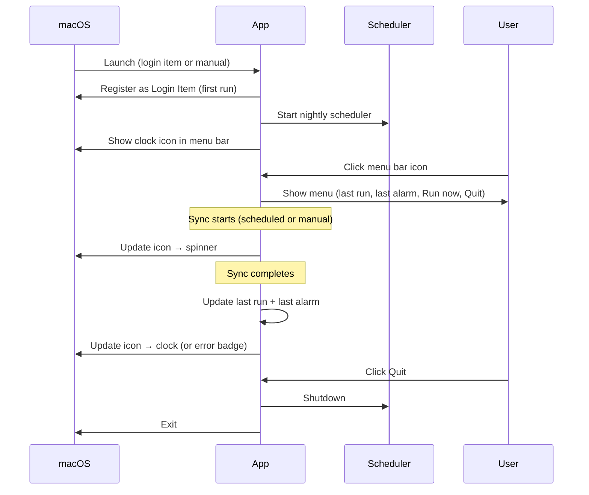

# What the feature is

A persistent macOS menu bar app that hosts the scheduler, displays sync status, and provides user-accessible controls. Shows a clock icon in the menu bar that updates to reflect sync state and errors. Configures itself to launch on Mac startup.

# Why we need it

All other features are headless modules. This feature is the shell that keeps everything running, surfaces status to the user, and provides the entry point for manual control.

# Acceptance Criteria (testable)

**AC1 — Menu bar icon appears on launch**
Given the app is started, when it initializes, then a clock icon appears in the macOS menu bar.

**AC2 — Menu items**
Given the menu bar icon is visible, when the user clicks it, then the dropdown contains: last run time, last computed alarm time, "Run now", a separator, and "Quit".

**AC3 — Last run time shown**
Given at least one sync has completed, when the user opens the menu, then the last run time is displayed in a human-readable format (e.g. "Last run: 9:02 PM").

**AC4 — Last computed alarm shown**
Given at least one sync has completed with a computed alarm time, when the user opens the menu, then the last computed alarm time is displayed (e.g. "Alarm: 8:25 AM").

**AC5 — No prior run state**
Given the app has never run a sync, when the user opens the menu, then last run and alarm display a placeholder indicating no sync has run yet.

**AC6 — Spinner during sync**
Given a sync is in progress, when the user looks at the menu bar, then the icon changes to indicate activity (spinner or animated state).

**AC7 — Icon returns to normal after sync**
Given a sync completes successfully, when the sync finishes, then the icon returns to the default clock state.

**AC8 — Error badge on failure**
Given the last sync failed, when the user looks at the menu bar, then the icon displays an error indicator until the next successful sync clears it.

**AC9 — Scheduler started on launch**
Given the app starts, when initialization completes, then the nightly scheduler (NPC-0004) is running in the background.

**AC10 — Launch on startup configured**
Given the app is installed, when the user first launches it, then it registers itself as a Login Item so it starts automatically on Mac login.

**AC11 — Quit stops scheduler**
Given the app is running, when the user clicks "Quit", then the scheduler is stopped cleanly before the app exits.

# System Constraints

- macOS only
- Requires NPC-0004 (scheduler) to be complete
- "Run now" menu item is a placeholder in this feature — its behavior is implemented in NPC-0006
- Last run and alarm state is held in memory — not persisted to disk in this feature
- Login Item registration uses macOS APIs, not a manual plist

# Non-goals

- On-demand sync logic (belongs in NPC-0006)
- Packaging as a .app bundle / PyInstaller (post-MVP)
- Custom icon design
- Preferences or settings window
- Persisting last run state across restarts

# Interaction Flow

