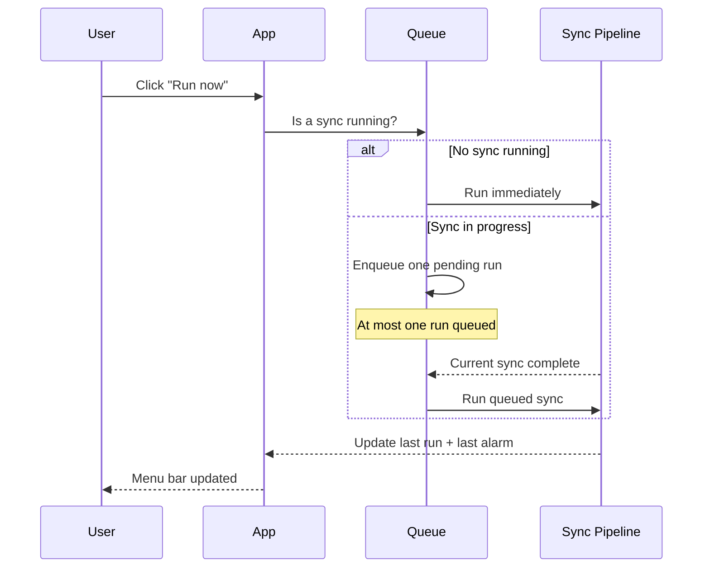

# What the feature is

Allows the user to manually trigger the full sync pipeline at any time via the "Run now" menu bar item. Runs the same pipeline as the nightly scheduler — read calendars, compute alarm, show confirmation popup, write to calendar. If a sync is already in progress, the manual run is queued and executes immediately after the current run completes.

# Why we need it

The 9pm trigger captures the calendar state at that moment. If a new meeting invitation arrives after 9pm, the computed alarm is stale. "Run now" lets the user re-run on demand and get a fresh result without waiting for the next night.

# Acceptance Criteria (testable)

**AC1 — Run now triggers pipeline**
Given the app is running, when the user clicks "Run now" in the menu, then the full sync pipeline executes: load config → read calendars → compute alarm → show confirmation popup → write to calendar (if confirmed).

**AC2 — Pipeline is identical to nightly**
Given "Run now" is triggered, when the pipeline runs, then it executes the same steps in the same order as the nightly scheduled sync — no steps are skipped or modified.

**AC3 — Queued when sync in progress**
Given a sync is already running when "Run now" is clicked, when the current sync finishes, then the manual sync runs immediately after — it is not dropped or ignored.

**AC4 — Queue depth of one**
Given a sync is in progress and "Run now" has already been queued, when the user clicks "Run now" again, then no additional run is added to the queue — at most one pending manual run exists at a time.

**AC5 — Menu bar state updated**
Given a manual sync completes, when the pipeline finishes, then the menu bar last run time and last computed alarm time are updated exactly as they would be after a nightly sync.

**AC6 — Spinner shown during manual sync**
Given a manual sync is in progress, when the user looks at the menu bar, then the spinner state is shown — identical to the nightly sync spinner behavior.

**AC7 — Error surfaced on failure**
Given the manual sync pipeline fails at any stage, when the error occurs, then it is surfaced to the user — identical to nightly sync error handling.

# System Constraints

- Entry point is the "Run now" menu item only (wired up in NPC-0005)
- Requires NPC-0001, NPC-0002, NPC-0003, and NPC-0005 to be complete
- Queue is in-memory, max depth of one pending run
- The manual sync reuses the exact same pipeline function as the scheduler

# Non-goals

- Any entry point other than the menu bar "Run now" item
- Skipping or modifying any pipeline step for manual runs
- Persisting the queue across app restarts
- Hotkey or keyboard shortcut trigger

# Interaction Flow

