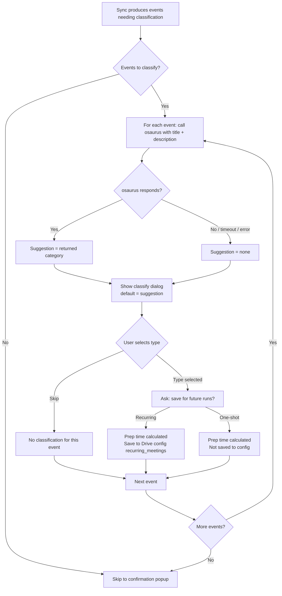

# Summary

When the nightly sync identifies a meeting that needs classification — an unknown work block or a personal calendar event without a known type — the system calls the local osaurus AI server to suggest a meeting type based on the event title and description. The suggestion appears pre-selected in the classification dialog so the user can confirm in one click or override it. After selecting a type, the user chooses whether to save the classification for future runs (recurring) or apply it this run only (one-shot). If osaurus is unavailable the dialog opens without a suggestion, preserving current behavior.

# Workflow

# ZeeSpec Framework

## WHAT — Define what exists and what doesn't.

**What does the system do?**
Before showing the classification dialog for any unknown meeting, the system queries the osaurus local AI server with the meeting title and description, receives a suggested meeting type, and pre-selects that type in the dialog.

**What are the main things in the system?**
- Unknown work (MSI) block: a work calendar time block not matched to any entry in `recurring_meetings`
- Unclassified personal event: a personal calendar event not previously assigned a meeting type
- Osaurus suggestion: a meeting type string returned by the AI server for a given title + description
- Classification: the meeting type the user confirms or overrides
- Recurring classification: a classification the user saves to Drive config for future auto-recognition
- One-shot classification: a classification applied only for the current sync run

**What can exist in the system?**
- A suggestion for any meeting type listed in `meeting_type_prep`
- A classification for any work block not yet in `recurring_meetings`
- A classification for any personal event in tomorrow's calendar
- A one-shot classification that recalculates alarm prep without writing to config

**What cannot exist in the system?**
- A suggestion outside the configured `meeting_type_prep` category list
- A silent failure — if osaurus is unavailable, the dialog still opens, just without a pre-selection
- A classification applied to the baseline alarm event
- A forced save when the user opts out of recurring

**What information must always be present?**
- The event title must be available for any event sent to osaurus
- The category list from `meeting_type_prep` must be present for the dialog

**What information is optional?**
- Event description (used if available; absent is valid)
- Osaurus suggestion (absent when server is unavailable)

**What states can each thing be in?**
- Meeting: unclassified → classified (recurring) | classified (one-shot)
- Osaurus call: pending → succeeded (suggestion available) | failed (no suggestion)

**What changes are allowed?**
- User may override any osaurus suggestion
- User may skip classification entirely for any event

**What changes are not allowed?**
- Osaurus suggestion cannot overwrite a user's confirmed choice
- A one-shot classification cannot be written to config without explicit user opt-in

**What should never be stored?**
- The raw osaurus API response beyond the selected category string
- The `api_key` from `osaurus.yaml` in logs or state files

---

## WHERE — Define boundaries and limits.

**Where can the system be accessed from?**
Classification happens during the nightly sync popup, in the background sync thread (sync_job.py).

**Where are actions performed?**
- osaurus call: background thread (sync_job.py), using the OpenAI-compatible client
- Dialog: foreground osascript dialog on the same machine

**Where is data allowed to go?**
- Suggested category string: from osaurus → pre-selected in dialog → accepted by user → prep calculation
- Recurring classifications: from user confirmation → Drive config `recurring_meetings`

**Where is data NOT allowed to go?**
- Event title/description must not be logged to any persistent file
- osaurus API key must not appear in stderr or log output

**Where are system boundaries?**
- osaurus server: `http://127.0.0.1:1337` (local only, configured in `osaurus.yaml`)
- Drive config: Google Drive file read/written via `drive_config`
- Calendar data: Google Calendar API (read-only for events)

**Where do external systems connect?**
- osaurus local server (HTTP, OpenAI-compatible `/v1/chat/completions`)
- Google Calendar API (event data: title, description)
- Google Drive API (config read/write)

**Where is access restricted?**
- osaurus is local-only — no remote call is ever made; if the server is not running, the feature degrades gracefully

**Where can failures occur?**
- osaurus server not running or unreachable
- osaurus returns an unrecognized category
- MSI calendar event has no title (untitled block)

**Where must the system always respond?**
- The classification dialog must always open, even when osaurus fails

---

## WHEN — Define timing and triggers.

**When is a suggestion generated?**
Immediately before each classification dialog is shown, during the sync popup flow.

**When is osaurus called?**
Once per event requiring classification (not batched). Called in the background sync thread, synchronously, with a short timeout.

**When is a classification saved to config?**
Only when the user confirms the type AND explicitly opts in to saving for future runs.

**When is a classification applied but not saved?**
When the user confirms the type but opts out of saving (one-shot selection).

**When is a suggestion skipped?**
- osaurus server is unreachable or returns an error
- osaurus returns a value not in `meeting_type_prep`

**When does the fallback trigger?**
Immediately on any osaurus error (network failure, timeout, non-200 response, unrecognized category). No retry.

**When does the sync pipeline block?**
Never — the osaurus call has a short timeout (≤ 3 seconds). Timeout is treated as failure → fallback.

---

## WHO — Define ownership and access.

**Who can use the system?**
The local user running the Phantom Calendar app.

**Who triggers key events?**
- System: triggers osaurus call automatically before each classification dialog
- User: confirms or overrides the suggestion; decides one-shot vs recurring

**Who approves important actions?**
The user explicitly approves every classification and every save to Drive config.

**Who should never be allowed to act?**
No remote party — osaurus is local-only and the classification write to Drive config requires user confirmation.

---

## WHY — Define intent and constraints.

**Why does this feature exist?**
The current classification dialog shows all meeting types with no pre-selection, requiring the user to read and choose each time. With meaningful titles and descriptions available from the calendar, an AI suggestion can reduce that to a single confirmation click for well-understood meeting types.

**Why are two outcomes needed (recurring vs one-shot)?**
Not every unknown meeting recurs. An interview, a doctor's appointment, or a one-off client call should not pollute `recurring_meetings` in config. Giving the user an explicit choice avoids stale config entries.

**Why is graceful fallback required?**
osaurus is a local development server — it may not always be running. The classification feature must not block or break the sync when osaurus is absent.

**Why is the timeout short (≤ 3 s)?**
The sync popup already keeps the user waiting. A slow AI call would make the experience feel broken.

**Why is the suggestion only a default, not enforced?**
The AI may be wrong. The user always has final say.

---

## HOW — Define behavior under all conditions.

**How does the system get the event title for work (MSI) blocks?**
The Google Calendar API returns the event summary (title) and description for each event. The MSI block reader must be extended to also return `title` and `description` alongside `start`/`end`. Untitled events use `"Untitled"` as the title sent to osaurus.

**How does the system get the event title for personal events?**
Personal events already carry a `title` field. `description` must be extracted from the calendar API response and included.

**How does osaurus receive the event?**
A single chat completion request with:
- System prompt: instructs the model to return exactly one category from `meeting_type_prep`
- User message: `Title: <title>\nDescription: <description>`
- `temperature=0`, `max_tokens=32`, timeout ≤ 3 s
- Model: `"foundation"` (default per osaurus rune)

**How is the suggestion validated?**
The returned string is checked against the keys of `meeting_type_prep`. If it does not match any key exactly, it is discarded and treated as no suggestion.

**How is the suggestion shown in the dialog?**
The `choose from list` osascript dialog uses the suggestion as the `default items` value when one is available. When no suggestion is available, `"Skip (keep default)"` remains the default.

**How does the user choose one-shot vs recurring?**
After the user selects a type (any type other than Skip), a second dialog asks: "Save this for future runs? Select 'Recurring' to remember it, or 'One-shot' to use it this run only." Two buttons: `Recurring` / `One-shot`.

**How does the system behave when osaurus times out?**
The call is abandoned, the suggestion is discarded, and the classification dialog opens immediately with no pre-selection. No error is shown to the user. A message is written to stderr.

**How does the system behave when osaurus returns an unknown category?**
Same as timeout — discarded, fallback to no pre-selection.

**How does it stay consistent with the existing classification write?**
Recurring classifications continue to use the existing `append_recurring_meetings` path in `drive_config`. One-shot classifications feed directly into the alarm calculation without touching Drive config.

**How does it handle an untitled MSI block?**
osaurus is called with `title="Untitled"` and an empty description. The suggestion is likely to be poor and the user can override. No special handling needed.

# Acceptance Criteria

**AC1 — MSI block reader returns title and description**
Given the Google Calendar API returns events for the MSI calendar, when `get_msi_time_blocks()` is called, then each block dict includes `title` (event summary, defaulting to `"Untitled"`) and `description` (event description, defaulting to `""`).

**AC2 — Personal event reader returns description**
Given a personal calendar event has a description field in the API response, when `get_personal_events()` is called, then the returned event dict includes `description`. Events without a description return `description=""`.

**AC3 — Osaurus called before classification dialog**
Given an unknown work block or unclassified personal event is about to be shown to the user, when the sync pipeline reaches the classification step, then the system calls osaurus with the event title and description before opening the dialog. The call uses model `"foundation"`, `temperature=0`, `max_tokens=32`, and a timeout of ≤ 3 seconds. No retry is attempted on failure.

**AC4 — Valid suggestion pre-selects dialog default**
Given osaurus returns a category string that exactly matches a key in `meeting_type_prep`, when the classification dialog opens, then that category is pre-selected as the default item.

**AC5 — Invalid or absent suggestion falls back gracefully**
Given osaurus is unreachable, times out, or returns a string not matching any `meeting_type_prep` key, when the classification dialog opens, then it opens with `"Skip (keep default)"` as the default (current behavior), no retry of the osaurus call is attempted, no error is shown to the user, and a message is written to stderr.

**AC6 — User can override the suggestion**
Given a suggestion is pre-selected in the dialog, when the user selects a different category and confirms, then the user-selected category is used — not the suggestion.

**AC7 — One-shot vs recurring prompt shown after type selection**
Given the user selects any meeting type other than `"Skip (keep default)"`, when the selection is confirmed, then a second dialog appears asking whether to save the classification for future runs, with two choices: `Recurring` and `One-shot`.

**AC8 — Recurring classification saved to config**
Given the user selects a type and then chooses `Recurring`, when the sync pipeline completes, then the classification is appended to `recurring_meetings` in the Drive config (existing behavior) and used for this run's alarm calculation.

**AC9 — One-shot classification used for alarm only**
Given the user selects a type and then chooses `One-shot`, when the sync pipeline completes, then the prep time is calculated from the selected type and used for alarm placement, and nothing is written to the Drive config for this meeting.

**AC10 — Personal events classified by type**
Given one or more personal events appear in tomorrow's calendar, when the sync popup runs the classification step, then each personal event is presented for type classification with an osaurus suggestion (if available).

**AC11 — Classification step skipped for baseline**
Given the sync result is a baseline match, when the popup runs, then no type classification dialog is shown (existing behavior unchanged).

**AC12 — Osaurus call error does not block sync**
Given osaurus raises any exception (connection refused, timeout, unexpected response), when the error occurs, then no retry is attempted, the classification dialog still opens without a suggestion, and the sync pipeline continues normally.

**AC13 — API key not logged**
Given any osaurus error or success, when the pipeline writes to stderr or any log, then the `api_key` value from `osaurus.yaml` does not appear in the output.

**AC14 — Skip leaves event unclassified**
Given the user selects `"Skip (keep default)"` in the classification dialog, when the selection is confirmed, then no meeting type is applied to that event, no prep time from this classification is calculated, and the Drive config is unchanged for that event.

**AC15 — Event title and description not persisted in logs**
Given any osaurus call succeeds or fails, when the pipeline writes to stderr or any state file, then the event title and description do not appear in any persistent log or state file.

**AC16 — Raw osaurus response not persisted**
Given any osaurus call succeeds or fails, when the pipeline processes the response, then no part of the osaurus response body other than the extracted category string is written to any persistent log, state file, or Drive config.

# Non-goals

- Batch osaurus calls (all events are classified one at a time, sequentially)
- Caching or persisting osaurus responses across sync runs
- Using osaurus during the nightly scheduler run without user interaction
- Replacing the osascript dialog with a native UI
- Classifying the baseline alarm event
- Auto-detecting Google Calendar recurrence from `recurringEventId` to bypass the one-shot/recurring prompt
- Any changes to `osaurus.yaml` format or location
