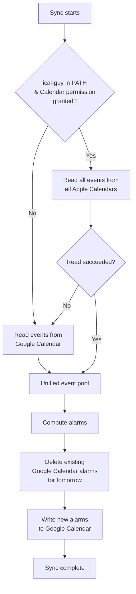

# Summary

Phantom Calendar adds Apple Calendar as a read-only event source on macOS, replacing Google Calendar for event querying when available. When ical-guy is installed and macOS Calendar permission is granted, tomorrow's events are read from all Apple Calendars and treated as a single unified pool — with no distinction between work and personal calendars. Prep alarm events continue to be written to Google Calendar regardless of which source is used for reading. If ical-guy is unavailable or Calendar permission is not granted, the system falls back to reading events from Google Calendar for that run.

# Workflow

# ZeeSpec Framework

## WHAT — Define what exists and what doesn't.

**What does the system do?**
On macOS with ical-guy installed and Calendar permission granted: reads tomorrow's events from all Apple Calendars as a single unified pool and feeds them into the existing alarm computation pipeline. Prep alarm events are always written to Google Calendar. When ical-guy is unavailable: reads events from Google Calendar as before — the alarm write path is unchanged in both cases.

**What are the main things in the system?**
- Apple Calendar reader: uses ical-guy to read all calendar events for tomorrow from all accessible Apple Calendars on macOS
- Unified event pool: all Apple Calendar events for tomorrow, without distinction between work and personal calendars
- Google Calendar reader: fallback read source when ical-guy is unavailable (existing behavior)
- Google Calendar writer: always used for alarm writes, regardless of read source (unchanged)
- Read source selection: automatic at the start of each sync run based on ical-guy availability; not user-facing

**What can exist in the system?**
- Events from any combination of Apple Calendars (work, personal, shared, iCloud, Exchange, etc.) in the unified pool
- An optional configured list of Apple Calendar names to exclude from the unified pool
- Google Calendar alarm write (always present — unchanged)

**What cannot exist in the system?**
- Apple Calendar writes — ical-guy is read-only; all alarm writes go to Google Calendar
- Apple Calendar reads on non-macOS platforms
- Apple Calendar reads without macOS Calendar permission granted to ical-guy
- Differentiation of events by Apple Calendar source within the compute pipeline

**What information must always be present?**
- Google Calendar alarm write configuration (unchanged — always required for alarm writes)

**What information is optional?**
- A list of Apple Calendar names to exclude from the unified event pool (defaults to empty — all calendars included)

**What states can each thing be in?**
- Read source per run: Apple Calendar via ical-guy | Google Calendar (fallback)
- ical-guy accessibility: accessible (installed + permission granted) | inaccessible
- Write target: Google Calendar (always — not subject to source selection)

**What changes are allowed?**
- Reading events from Apple Calendar via ical-guy (read-only access)
- Writing alarm events to Google Calendar (unchanged behavior)

**What changes are not allowed?**
- Writing any events to Apple Calendar
- Modifying or deleting any Apple Calendar events

**What should never be stored?**
- Apple Calendar event data in any persistent state file

---

## WHERE — Define boundaries and limits.

**Where can the system be accessed from?**
Apple Calendar reads are macOS-only. On any other platform, the system reads from Google Calendar.

**Where are actions performed?**
- Reads (Apple path): local macOS system call via ical-guy CLI (EventKit-based, read-only)
- Reads (Google fallback): Google Calendar API (existing behavior)
- Writes: Google Calendar API (unchanged, always used for alarm writes regardless of read source)

**Where is data allowed to go?**
- Read event data is used only within the sync pipeline (title, start/end, description, location)
- Alarm events continue to be written to Google Calendar only

**Where is data NOT allowed to go?**
- No event data is sent to any remote service during Apple Calendar reads (ical-guy is local only)
- No events are written to Apple Calendar by this system

**Where are system boundaries?**
- Apple Calendar: local macOS Calendar.app (read via ical-guy EventKit CLI)
- ical-guy: macOS CLI tool, local only
- Google Calendar API: always the alarm write target; read fallback when ical-guy unavailable

**Where do external systems connect?**
- ical-guy (local system call) for reading events from Apple Calendar
- Google Calendar API for alarm writes and fallback reads (existing behavior)

**Where is access restricted?**
- macOS requires a one-time Calendar permission grant for ical-guy to access Apple Calendar
- ical-guy provides read-only access to Calendar.app; the system writes nothing to Apple Calendar

**Where can failures occur?**
- ical-guy not installed or not in PATH
- macOS Calendar permissions not granted or revoked
- ical-guy returns an error or unexpected output during event read

**Where must the system always respond?**
- A sync run must always complete — if Apple Calendar reads fail, Google Calendar reads are used; alarm writes always target Google Calendar

---

## WHEN — Define timing and triggers.

**When is Apple Calendar used?**
For event reading at the start of every sync run (nightly and on-demand), when ical-guy is installed and Calendar permission is granted.

**When does read source selection happen?**
Once per sync run, at the beginning. The write path (Google Calendar) is not subject to source selection — it is always Google Calendar.

**When does fallback occur for reads?**
When ical-guy is not in PATH, Calendar permission is not granted, or ical-guy returns an error during the event read for tomorrow.

**When are events excluded from the unified pool?**
All-day events (no specific start and end time) are always excluded. Events from Apple Calendars named in `apple_exclude_calendars` config are excluded.

**When are Apple Calendar alarms cleaned up?**
Never — the system does not write alarms to Apple Calendar. All alarms are in Google Calendar and follow the existing delete-then-write behavior each run.

**When must the system respond?**
Every sync run must complete — using Apple Calendar or Google Calendar as the read source. Alarm writes always target Google Calendar.

---

## WHO — Define ownership and access.

**Who can use the system?**
The local macOS user running the Phantom Calendar app.

**Who grants access?**
macOS prompts the user for Calendar permission on first ical-guy access (one-time system dialog). The user must allow it.

**Who can create and delete alarm events?**
Only the system (during a sync run), via Google Calendar API. The user can also manually delete alarm events in Google Calendar or via Calendar.app if the Google calendar is synced there.

**Who cannot access certain data?**
ical-guy has read-only access to Calendar.app. The system must not attempt any write to Apple Calendar.

**Who should never be allowed to act?**
No remote party — Apple Calendar reads are local system calls via ical-guy. Alarm writes are Google Calendar API calls, unchanged from existing behavior.

---

## WHY — Define intent and constraints.

**Why does this feature exist?**
Users on macOS may have events spread across multiple calendars not all visible through Google Calendar (e.g., iCloud-only calendars, Exchange calendars, shared calendars synced via Calendar.app). Reading from Apple Calendar via ical-guy gives a complete view of tomorrow's schedule without requiring per-calendar Google configuration.

**Why is the write path unchanged?**
ical-guy is read-only by design. Writing alarms to Apple Calendar would require AppleScript or direct EventKit write access, adding complexity, new permission requirements, and potential sync issues with Google Calendar (which Sleep as Android reads from). The existing Google Calendar write path is reliable and sufficient.

**Why is the unified pool approach used?**
Differentiating between work and personal Apple Calendars requires user configuration that may not cleanly map to reality (a user may have multiple work calendars, multiple personal calendars, or shared team calendars). Treating all events as one pool is simpler, more robust, and consistent with how ical-guy surfaces events.

**Why is read source selection automatic?**
Requiring the user to manually enable or disable Apple Calendar reads adds friction. Availability can be reliably detected at runtime.

**Why is Google Calendar retained as the fallback read source?**
ical-guy may not be installed or Calendar permissions may not be granted. The fallback ensures continuity without requiring user intervention.

---

## HOW — Define behavior under all conditions.

**How does the system detect ical-guy availability?**
Checks that ical-guy is present in PATH using `shutil.which("ical-guy")`. If found, runs `ical-guy calendars --format json` to confirm Calendar permission is granted (non-zero exit or permission error → unavailable → fall back to Google Calendar reads silently).

**How does the system read Apple Calendar events?**
Invokes `ical-guy events --from {tomorrow_iso} --to {tomorrow_iso} --exclude-all-day --format json`. If `apple_exclude_calendars` is configured, adds `--exclude-calendars "{name1},{name2}"`. Parses the JSON array — each event object contains `id`, `title`, `startDate` (ISO 8601), `endDate` (ISO 8601), `location` (nullable), `notes` (nullable). Converts to the standard event dict shape used by the compute pipeline. All events from all Apple Calendars are returned as one unified list.

**How does the system fall back to Google Calendar reads?**
If ical-guy is unavailable (not in PATH, non-zero exit, or permission denied), the existing `get_msi_time_blocks()` and `get_personal_events()` Google Calendar functions are called. This is identical to pre-NPC-0014 behavior.

**How does the write path work?**
Unchanged — `run_calendar_write()` in `calendar_writer.py` writes alarm events to Google Calendar regardless of which read source was used. No changes to the write path are made by this feature.

**How does the system inform the user of read source fallback?**
If ical-guy returns an error during the event read (after previously being available), the user is notified via `rumps.notification` with the specific reason. If ical-guy was never installed, fallback is silent — identical to how the system behaved before this feature.

**How does the unified event pool feed into the existing compute pipeline?**
All Apple Calendar events for tomorrow are collected into a single list. This list is fed into `compute_alarm()` in place of the combined Google Calendar reads. The compute pipeline receives one unified event collection and applies the existing matching, classification, and prep time logic.

---

# Acceptance Criteria

**AC1 — ical-guy available → Apple Calendar reads**
Given ical-guy is installed, in PATH, and macOS Calendar permission is granted, when a sync run starts, then tomorrow's events are read from all Apple Calendars via ical-guy and treated as a unified pool.

**AC2 — ical-guy not installed → Google Calendar reads (silent)**
Given ical-guy is not in PATH, when a sync run starts, then the system reads events from Google Calendar without notification.

**AC3 — Calendar permissions not granted → Google Calendar reads (silent)**
Given ical-guy is in PATH but macOS Calendar permissions have not been granted, when a sync run starts, then the system reads events from Google Calendar without notification.

**AC4 — ical-guy read failure → Google Calendar reads with notification**
Given ical-guy is available but returns an error during the event read, when the failure is detected, then the system falls back to Google Calendar reads and notifies the user of the specific reason.

**AC5 — Unified pool includes all Apple Calendars**
Given Apple Calendar reads are active, when tomorrow's events are read, then events from all accessible Apple Calendars appear in the unified pool regardless of which calendar they belong to (work, personal, shared, iCloud, Exchange, etc.).

**AC6 — Excluded calendars omitted**
Given `apple_exclude_calendars` is configured with one or more calendar names, when Apple Calendar reads run, then events from those named calendars are not included in the unified pool.

**AC7 — All-day events excluded**
Given Apple Calendar reads are active, when tomorrow's events are read, then events with no specific start and end time are excluded from the unified pool.

**AC8 — Alarm writes always target Google Calendar**
Given any sync run completes (whether Apple Calendar or Google Calendar reads were used), when alarms are written, then alarm events are written to Google Calendar via the existing write pipeline; no alarms are written to Apple Calendar.

**AC9 — macOS-only constraint**
Given the app is running on a non-macOS platform, when a sync run starts, then Apple Calendar reads are not attempted and the system reads from Google Calendar directly.

**AC10 — Apple Calendar event data not persisted**
Given a sync run completes using Apple Calendar reads, when any persistent state files are inspected, then no Apple Calendar event data (titles, start/end times, or descriptions) appears in them.

**AC11 — Google Calendar pipeline unchanged when Apple Calendar not used**
Given Apple Calendar reads are not active (ical-guy unavailable or non-macOS), when a sync run completes, then behavior is identical to pre-NPC-0014 behavior.

**AC12 — No user-facing read source selection**
Given the app's configuration and user interface, when inspected, then no user-facing option to manually select between Apple Calendar and Google Calendar as the event read source is present; selection is automatic.
