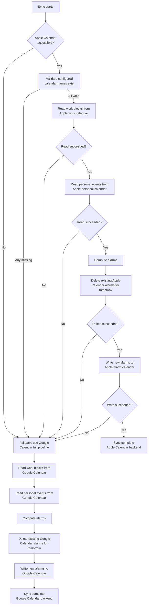

# Summary

Phantom Calendar adds Apple Calendar as a first-class backend for reading tomorrow's calendar events and writing prep alarm events on macOS. When Apple Calendar is accessible and the required calendar names are configured, it replaces the Google Calendar API for both reads and writes. If Apple Calendar is unavailable at the start of a sync run — icalbuddy not installed, Calendar permissions not granted, or a configured calendar name missing — the system falls back to Google Calendar automatically and completes the run using the existing backend. Google Calendar config remains valid and serves as the fallback.

# Workflow

# ZeeSpec Framework

## WHAT — Define what exists and what doesn't.

**What does the system do?**
Reads tomorrow's work blocks and personal events from named Apple Calendars, computes prep alarms, and writes alarm events back to a named Apple Calendar — without requiring Google OAuth credentials. Falls back to Google Calendar when Apple Calendar is unavailable.

**What are the main things in the system?**
- Work calendar: a named Apple Calendar that holds work time blocks
- Personal calendar: a named Apple Calendar that holds personal events
- Alarm calendar: a named Apple Calendar where prep alarm events are written
- Apple Calendar backend: the primary pipeline using AppleScript/icalbuddy for reads and writes
- Google Calendar backend: the unchanged fallback pipeline used when Apple Calendar is inaccessible
- Backend selection: automatic at the start of each sync run; not user-facing

**What can exist in the system?**
- One configured Apple Calendar name for work, one for personal, one for alarms
- Alarm events tagged as phantom-calendar-written in the alarm calendar
- Google Calendar config (existing) that serves as fallback when Apple Calendar is unavailable

**What cannot exist in the system?**
- Apple Calendar backend on non-macOS platforms
- Apple Calendar reads or writes without the required macOS Calendar permission
- Alarm events written to any calendar that is not the configured alarm calendar
- Alarm events without the phantom-calendar alarm tag in their description

**What information must always be present?**
- Apple Calendar work calendar name (required to use Apple backend)
- Apple Calendar personal calendar name (required to use Apple backend)
- Apple Calendar alarm calendar name (required to use Apple backend)

**What information is optional?**
- Google Calendar config remains optional if the user never needs the fallback (but all three Apple names must be valid for Apple backend to activate)

**What states can each thing be in?**
- Backend per run: Apple (primary) | Google (fallback)
- Apple Calendar accessibility: accessible | inaccessible (icalbuddy missing, permissions denied, or a configured calendar name not found)
- Alarm event: present in alarm calendar | absent (before first write or after deletion)

**What changes are allowed?**
- Creating alarm events in the Apple Calendar alarm calendar
- Deleting previously created alarm events from the Apple Calendar alarm calendar

**What changes are not allowed?**
- Modifying, creating, or deleting events in the work or personal Apple Calendars (read-only)
- Writing to any Apple Calendar other than the configured alarm calendar

**What should never be stored?**
- Events outside tomorrow's date range during a sync read
- Apple Calendar event data in any persistent state file

---

## WHERE — Define boundaries and limits.

**Where can the system be accessed from?**
Apple Calendar access is macOS-only. On any other platform, Apple Calendar backend is not available and the system uses Google Calendar.

**Where are actions performed?**
- Reads: local macOS system call via icalbuddy command-line tool
- Writes and deletes: local macOS AppleScript execution targeting Calendar.app

**Where is data allowed to go?**
- Alarm events go only to the user's configured Apple Calendar alarm calendar
- Read event data is used only within the sync pipeline (title, start/end, description)

**Where is data NOT allowed to go?**
- No event data is sent to any remote service during Apple Calendar reads or writes
- Apple Calendar reads and writes do not affect Google Calendar (the two backends are independent)

**Where are system boundaries?**
- Apple Calendar: macOS system Calendar service (Calendar.app)
- icalbuddy: third-party CLI tool installed on the macOS system
- Google Calendar API: fallback only

**Where do external systems connect?**
- icalbuddy (local system call) for reading events
- AppleScript → Calendar.app (local) for writing and deleting alarm events

**Where is access restricted?**
- macOS requires a one-time Calendar permission grant; the app cannot access Apple Calendar without it
- Reads are restricted to the two configured calendar names only

**Where can failures occur?**
- icalbuddy not installed or not in PATH
- macOS Calendar permissions not granted or revoked
- Configured Apple Calendar name does not exist in the user's Calendar
- icalbuddy returns an unexpected format
- AppleScript write or delete fails

**Where must the system always respond?**
- A sync run must always complete — if any Apple Calendar step fails, the full pipeline retries via Google Calendar

---

## WHEN — Define timing and triggers.

**When is Apple Calendar used?**
At the start of every sync run (nightly and on-demand), before Google Calendar is tried.

**When does backend selection happen?**
Once per sync run, at the beginning. The backend cannot switch mid-run.

**When does fallback occur?**
When any of the following is true at sync start:
- icalbuddy is not installed
- macOS Calendar permissions are not granted
- Any configured Apple Calendar name does not exist in Calendar.app
- A read or write operation against Apple Calendar returns an error

**When are alarm events deleted?**
At the start of the write phase of each sync run, before new alarms are written, using the same backend as the current run.

**When are Google Calendar alarms cleaned up after switching to Apple backend?**
Never automatically. If the previous run used Google Calendar and the current run uses Apple Calendar, the old Google alarms remain until a future Google-backend run (or manual deletion).

**When are Apple Calendar alarms cleaned up after switching to Google backend?**
Never automatically. If the previous run used Apple Calendar and the current run falls back to Google Calendar, the Apple Calendar alarms remain until a future Apple-backend run.

**When must the system respond?**
Every sync run must complete — either with Apple Calendar or with Google Calendar as fallback. No sync run ends without alarm events being written via one of the two backends.

---

## WHO — Define ownership and access.

**Who can use the system?**
The local macOS user running the Phantom Calendar app.

**Who grants access?**
macOS prompts the user for Calendar permission on first access (one-time system dialog). The user must allow it.

**Who can create and delete alarm events?**
Only the system (during a sync run). The user can also manually delete alarm events in Calendar.app.

**Who cannot access certain data?**
The system has read-only access to the work and personal Apple Calendars. It must not modify any events in those calendars.

**Who should never be allowed to act?**
No remote party — all Apple Calendar operations are local system calls.

---

## WHY — Define intent and constraints.

**Why does this feature exist?**
Users who rely on Apple Calendar as their primary calendar can use Phantom Calendar without setting up Google OAuth credentials. Local calendar access is faster, requires no API keys, and is offline-capable.

**Why is Google Calendar retained as fallback?**
Apple Calendar may be inaccessible (e.g., on a different machine, permissions revoked, icalbuddy not installed). The fallback ensures continuity without requiring user intervention.

**Why is backend selection automatic?**
Requiring the user to manually switch backends adds friction and risk of misconfiguration. The system can detect accessibility reliably.

**Why are calendar names required in config rather than auto-detected?**
Apple Calendar names are user-defined and vary widely. Auto-detection would risk reading from the wrong calendar.

**Why is write access limited to the alarm calendar only?**
Work and personal calendars contain real user data. The system must never mutate them.

**Why are orphaned alarms from backend switches accepted?**
Cleaning up the other backend's alarms would require access to both backends simultaneously, adding complexity and a new failure mode. Orphaned alarms are infrequent and low-impact (they expire after the target date).

**Why is the backend fixed per run?**
A mid-run switch (e.g., Apple read + Google write) would create inconsistency in alarm state — especially for deletion of previous alarms.

---

## HOW — Define behavior under all conditions.

**How does the system detect Apple Calendar accessibility?**
Checks that icalbuddy is present in PATH AND that macOS Calendar permissions are granted (by attempting a lightweight probe read).

**How does the system validate configured calendar names?**
Before reading, the system queries the list of available calendar names from Calendar.app and confirms each configured name exists.

**How does the system read Apple Calendar events?**
Invokes icalbuddy with the configured calendar name and tomorrow's date range. Parses output to extract title, start time, end time, and description for each timed event. All-day events (no specific start/end time) are excluded.

**How does the system write alarm events to Apple Calendar?**
Executes an AppleScript command targeting Calendar.app to create a new event in the configured alarm calendar with the alarm start time, alarm end time (alarm start + prep minutes = event duration), title, and a description containing the alarm tag.

**How does the system identify alarm events to delete?**
Queries the alarm calendar for tomorrow's date range and filters events whose description contains the alarm tag.

**How does the system fall back to Google Calendar?**
Any failure in the Apple Calendar pipeline (access check, validation, read, delete, write) triggers a full reset to the Google Calendar pipeline. For the write phase specifically: if alarm deletion from Apple Calendar has already succeeded but the subsequent write fails, the committed deletion remains (this is correct — it prevents orphaned Apple Calendar alarms when the run continues with Google Calendar). No new alarm events are written to Apple Calendar before fallback.

**How does the system inform the user of fallback?**
Whenever the system falls back to Google Calendar — regardless of the cause (icalbuddy missing, permissions denied, calendar name not found, or any read/write failure) — the user is informed of the reason via the same status or notification channel used for other sync outcomes.

**How does it behave when a configured calendar name does not exist?**
Treated as inaccessible — fallback to Google Calendar for the full run. The specific missing calendar name is included in the reason surfaced to the user.

**How does it stay consistent across runs?**
Each run deletes then rewrites alarms using the same backend. Cross-backend orphaned alarms are a known, accepted edge case.

---

# Acceptance Criteria

**AC1 — Apple Calendar work calendar name in config**
Given the system config file, when the user sets the Apple Calendar work calendar name, then the system reads tomorrow's work blocks exclusively from that named Apple Calendar.

**AC2 — Apple Calendar personal calendar name in config**
Given the system config file, when the user sets the Apple Calendar personal calendar name, then the system reads tomorrow's personal events exclusively from that named Apple Calendar.

**AC3 — Apple Calendar alarm calendar name in config**
Given the system config file, when the user sets the Apple Calendar alarm calendar name, then the system writes prep alarm events exclusively to that named Apple Calendar.

**AC4 — icalbuddy not installed triggers fallback**
Given a sync run starts, when icalbuddy is not installed on the system, then the system uses Google Calendar for the full pipeline and informs the user of the specific reason (icalbuddy not found).

**AC5 — Calendar permissions not granted triggers fallback**
Given a sync run starts and icalbuddy is installed, when macOS Calendar permissions have not been granted to the app, then the system falls back to Google Calendar for the full pipeline and informs the user of the reason.

**AC6 — Missing configured calendar name triggers fallback**
Given a sync run starts and Apple Calendar is accessible, when any of the three configured Apple Calendar names does not exist in Calendar.app, then the system falls back to Google Calendar for the full pipeline and reports which name was not found.

**AC7 — Work block reading from Apple Calendar**
Given Apple Calendar is accessible and the work calendar name resolves to an existing calendar, when the sync reads tomorrow's schedule, then all timed events (with explicit start and end times) from that Apple Calendar for tomorrow are retrieved.

**AC8 — Personal event reading from Apple Calendar**
Given Apple Calendar is accessible and the personal calendar name resolves to an existing calendar, when the sync reads tomorrow's schedule, then all timed events from that Apple Calendar for tomorrow are retrieved.

**AC9 — All-day events excluded**
Given Apple Calendar is accessible, when the sync reads tomorrow's events from either the work or personal Apple Calendar, then events that have only a date (no specific start/end time) are excluded from the results.

**AC10 — Events from other calendars not included**
Given Apple Calendar is accessible, when the sync reads tomorrow's schedule, then events from Apple Calendars not matching the configured work or personal calendar names are not included.

**AC11 — Alarm event written to Apple Calendar**
Given Apple Calendar is accessible and a prep alarm is computed, when the sync writes alarms, then a new event is created in the configured Apple Calendar alarm calendar at the computed alarm time with the correct title and duration.

**AC12 — Alarm event tagged**
Given an alarm event is written to Apple Calendar, when the event is inspected in Calendar.app, then the event description contains the phantom-calendar alarm tag that identifies it as system-written.

**AC13 — Previous Apple Calendar alarms deleted before write**
Given Apple Calendar is accessible and tagged alarm events from a previous run exist in the alarm Apple Calendar for tomorrow, when the sync enters the write phase, then all previously tagged alarm events for tomorrow are deleted before any new alarms are written.

**AC14 — Alarm events not written to work or personal calendars**
Given Apple Calendar is accessible, when the sync writes alarm events, then no alarm events are created in the work or personal Apple Calendars.

**AC15 — Fallback uses full Google Calendar pipeline**
Given Apple Calendar is unavailable or any Apple Calendar operation fails, when the system falls back, then the entire pipeline (read work blocks, read personal events, delete old alarms, write new alarms) runs against Google Calendar. No new alarm events are written to Apple Calendar before fallback. If alarm deletion from Apple Calendar had already succeeded before a write failure, that deletion is preserved and not reversed.

**AC16 — Fallback reason surfaced to user**
Given the system falls back to Google Calendar during a sync run, when the run completes, then the user is informed (via status or notification) of the specific reason for the fallback (e.g., icalbuddy not found, permissions denied, calendar name not found, or read/write failure) and that Google Calendar was used.

**AC17 — Backend fixed per sync run**
Given a sync run begins, when the backend is selected (Apple or Google), then that backend is used for all operations within that run — the backend does not switch mid-run.

**AC18 — Orphaned alarms from backend switch are accepted**
Given the previous sync run used Apple Calendar and the current run falls back to Google Calendar (or vice versa), when the current run completes, then alarm events written by the previous backend remain in their respective calendar until a future run using that backend cleans them up. The system does not attempt cross-backend deletion.

**AC19 — macOS-only constraint**
Given the app is running on a non-macOS platform, when a sync run starts, then Apple Calendar backend is not attempted and the system proceeds directly with Google Calendar.

**AC20 — Apple Calendar event data not persisted or transmitted**
Given a sync run completes using the Apple Calendar backend, when any persistent state files are inspected, then no Apple Calendar event data (titles, start/end times, or descriptions) appears in them. When the backend performs reads or writes, no event data is transmitted to any remote network endpoint.
**AC21 — Work and personal Apple Calendars are read-only**
Given Apple Calendar is accessible, when a sync run executes, then no existing events in the work or personal Apple Calendars are modified or deleted by the system.

**AC22 — Read results contain only tomorrow's events**
Given Apple Calendar is accessible, when the sync reads tomorrow's events from the work or personal Apple Calendar, then no events whose date falls outside tomorrow's date range appear in the retrieved results.

**AC23 — Apple Calendar backend requires no Google credentials**
Given Apple Calendar is accessible and all three Apple Calendar names are configured, when no Google OAuth credentials or Google Calendar config are present, then a sync run completes successfully using the Apple Calendar backend.

**AC24 — No user-facing backend selection option**
Given the app's configuration and user interface, when inspected, then no user-facing option to manually select between Apple Calendar and Google Calendar backends is present; backend selection is automatic.
